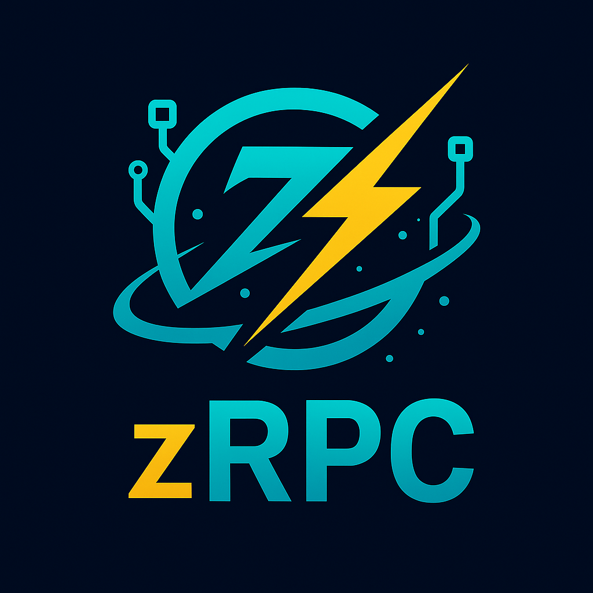

<div align="center">
  

  # zRPC

  [](RELEASE_NOTES.md)
  [](TODO.md)
  [](https://ziglang.org/)
  [](https://ziglang.org/download/)
  [](https://tools.ietf.org/html/rfc9000)
  [](https://tools.ietf.org/html/rfc7540)
  [](https://tools.ietf.org/html/rfc8446)
  [](https://tools.ietf.org/html/rfc6749)
  [](https://tools.ietf.org/html/rfc7519)
</div>

**Transport-agnostic RPC framework for Zig.** A modular, pluggable architecture with a lean core and transport adapters for QUIC, HTTP/2, and custom protocols.

## ✨ Features

### 🏗️ **Modular Architecture**
- **Transport-Agnostic Core**: Clean separation between RPC logic and transport layer
- **Pluggable Adapters**: QUIC, HTTP/2, or custom transport implementations
- **Explicit Injection**: No magic URL detection - explicit transport configuration

### 🚀 **Complete RPC Support**
- **All RPC Types**: Unary, client-streaming, server-streaming, and bidirectional streaming
- **Standard Protocol**: gRPC-compatible message framing and headers
- **Protocol Buffers**: Full protobuf v3 support with optional JSON codec for debugging

### 🔧 **Developer Experience**
- **Minimal Dependencies**: Core has zero transport dependencies
- **Clean APIs**: `Client.init(allocator, .{.transport = adapter})`
- **Code Generation**: Complete .proto file parsing and Zig code generation
- **CLI Tools**: `zrpc run --quic 127.0.0.1:8443 Service/Method '{"x":1}'` *(coming soon)*

### ⚡ **High Performance**
- **QUIC-First**: Built on fast QUIC transport with 0-RTT connection resumption
- **Zero-Copy**: Minimal allocations with caller-controlled memory management
- **Advanced Features**: Connection migration, path validation, load balancing

### 🔒 **Security & Observability**
- **TLS 1.3**: Transport adapters handle encryption and certificate validation
- **Authentication**: JWT/OAuth2 token building (verification in optional packages)
- **Metrics**: Prometheus counters for calls, latency buckets *(coming soon)*
- **Compression**: Optional zstd per-message compression *(coming soon)*

## 🏗️ Architecture

```
zrpc-ecosystem/
├── zrpc-core/                    # Transport-agnostic RPC framework
│   ├── Client & Server APIs      # Clean, explicit transport injection
│   ├── Streaming RPC support     # Unary, client, server, bidirectional
│   ├── Protobuf & JSON codecs    # Protocol buffer serialization
│   ├── Service definitions       # Method dispatch and error handling
│   └── Transport SPI             # Minimal adapter contract
│
├── zrpc-transport-quic/          # QUIC transport adapter (primary)
│   ├── QUIC connection adapter   # Maps SPI to QUIC streams
│   ├── 0-RTT connection resumption
│   ├── Connection migration & path validation
│   └── Advanced QUIC features    # Multiplexing, flow control
│
├── zrpc-transport-http2/         # HTTP/2 transport adapter (planned)
│   ├── HTTP/2 connection adapter
│   ├── TLS 1.3 support
│   └── Connection multiplexing
│
└── zrpc-tools/                   # Developer utilities
    ├── Proto parser & codegen    # .proto → Zig code generation
    ├── CLI utilities            # `zrpc run --quic ...`
    ├── Contract test harness    # Transport adapter validation
    └── Benchmarking framework   # Performance testing vs gRPC
```

### 🔌 **Transport Adapter Interface**

```zig
// Minimal, locked SPI - all adapters implement this
pub const Transport = struct {
    connect: fn(allocator, endpoint, tls_config) !Connection,
    listen: fn(allocator, bind_address, tls_config) !Listener,
};

pub const Connection = struct {
    openStream: fn() !Stream,
    ping: fn() !void,
    close: fn() void,
};

pub const Stream = struct {
    writeFrame: fn(frame_type, flags, data) !void,
    readFrame: fn(allocator) !Frame,
    cancel: fn() void,  // Maps to QUIC STOP_SENDING/RESET
};
```

## 🚀 Quick Start

### Installation

**Step 1**: Add both core and transport adapter to your `build.zig.zon`:

```zig
.dependencies = .{
    .@"zrpc-core" = .{
        .url = "https://github.com/ghostkellz/zrpc/releases/download/v0.4.0-beta.1/zrpc-core.tar.gz",
        .hash = "...", // Will be filled by `zig fetch`
    },
    .@"zrpc-transport-quic" = .{
        .url = "https://github.com/ghostkellz/zrpc/releases/download/v0.1.0-beta.1/zrpc-transport-quic.tar.gz",
        .hash = "...", // Will be filled by `zig fetch`
    },
},
```

**Step 2**: Add to your `build.zig`:

```zig
const zrpc_core = b.dependency("zrpc-core", .{}).module("zrpc-core");
const zrpc_quic = b.dependency("zrpc-transport-quic", .{}).module("zrpc-transport-quic");

exe.root_module.addImport("zrpc-core", zrpc_core);
exe.root_module.addImport("zrpc-transport-quic", zrpc_quic);
```

### Basic Usage - Explicit Transport Injection

```zig
const std = @import("std");
const zrpc_core = @import("zrpc-core");
const zrpc_quic = @import("zrpc-transport-quic");

// Define your service handler
fn sayHello(request: *zrpc_core.RequestContext, response: *zrpc_core.ResponseContext) !void {
    // Parse request, call business logic
    const greeting = "Hello from QUIC-gRPC!";
    response.data = greeting;
    response.status_code = 0; // OK
}

pub fn main() !void {
    var gpa = std.heap.GeneralPurposeAllocator(.{}){};
    defer _ = gpa.deinit();
    const allocator = gpa.allocator();

    // Create QUIC transport adapter (explicit injection)
    const transport = zrpc_quic.createServerTransport(allocator);

    // Create server with transport
    var server = zrpc_core.Server.init(allocator, .{ .transport = transport });
    defer server.deinit();

    // Register handlers
    try server.registerHandler("MyService/SayHello", sayHello);

    // Bind and serve
    try server.bind("127.0.0.1:8080", null);
    try server.serve();
}
```

### Client Example

```zig
// Create QUIC transport for client
const transport = zrpc_quic.createClientTransport(allocator);

// Create client with explicit transport injection
var client = zrpc_core.Client.init(allocator, .{ .transport = transport });
defer client.deinit();

// Connect and call
try client.connect("127.0.0.1:8080", null);
const response = try client.call("MyService/SayHello", "World");
defer allocator.free(response);

std.debug.print("Response: {s}\n", .{response});
```

## 🔧 Building & Testing

```bash
# Build modular architecture
zig build

# Run core tests (no transport dependencies)
zig build test-core

# Run adapter tests with real QUIC
zig build test-quic

# Run contract tests (core ↔ adapter)
zig build test-contract

# Run ALPHA-1 acceptance tests
zig build alpha1

# Run micro-benchmarks
zig build bench

# Build with specific features
zig build -Dprotobuf=true -Djson=true -Dquic=true
```

## 📈 Performance

Built for high performance with transport adapter flexibility:

- **Minimal Allocations**: Caller-controlled memory management, zero hidden allocs
- **QUIC 0-RTT**: Sub-millisecond connection resumption for returning clients
- **Connection Migration**: Seamless handoff between network paths
- **Frame-Level Control**: Direct control over RPC message framing and flow
- **Benchmarked**: Contract-tested performance across transport implementations

**BETA Performance Goals** (measured on loopback):
- Unary RPC (1KB): < 100μs p95 latency
- Streaming (4KB×100): > 1GB/s throughput
- Connection setup: < 1ms with 0-RTT

## 🔐 Security & Layered Architecture

**Core Responsibilities** (transport-agnostic):
- **Auth Header Building**: JWT/OAuth2 token construction and formatting
- **Deadline Management**: Request timeout enforcement and cancellation
- **Error Taxonomy**: Standard error mapping across all transports

**Transport Adapter Responsibilities**:
- **TLS 1.3**: Certificate validation and encrypted connections
- **QUIC Security**: Built-in encryption, connection ID privacy
- **Path Validation**: Secure connection migration with cryptographic proof

**Optional Security Packages** (separate from core):
- **zrpc-auth**: JWT signature verification, OAuth2 validation
- **zrpc-middleware**: Request authentication, rate limiting

## 🤝 Contributing

Contributions are welcome! Please see our [Contributing Guide](CONTRIBUTING.md) for details.

## 📄 License

This project is licensed under the MIT License - see the [LICENSE](LICENSE) file for details.

## 🙏 Acknowledgments

- Built with the amazing [Zig](https://ziglang.org/) programming language
- Inspired by [gRPC](https://grpc.io/) but designed for Zig-native development
- QUIC implementation based on [RFC 9000](https://tools.ietf.org/html/rfc9000)
